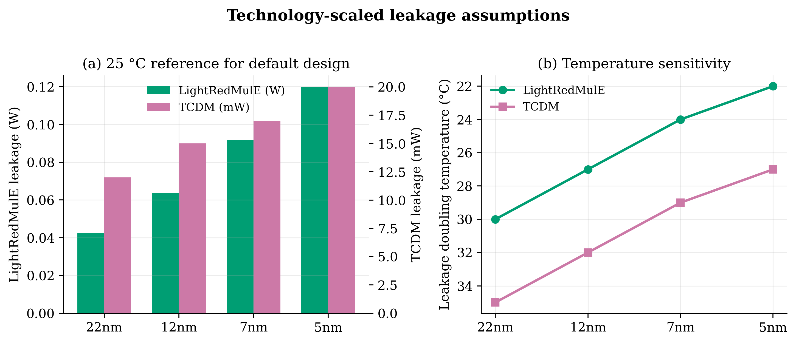
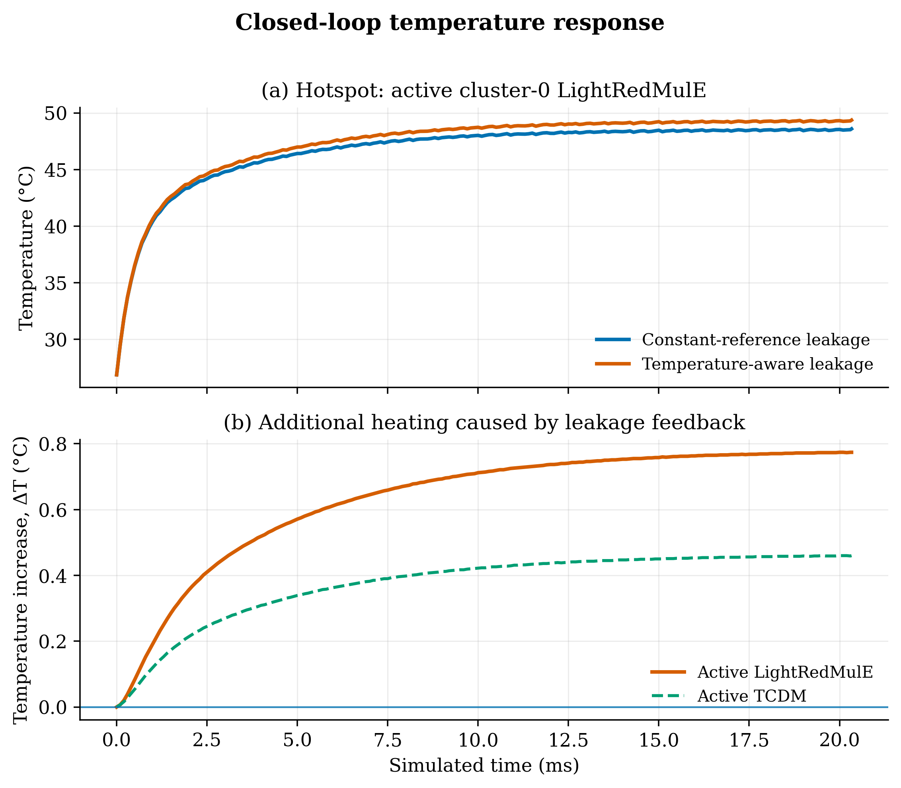
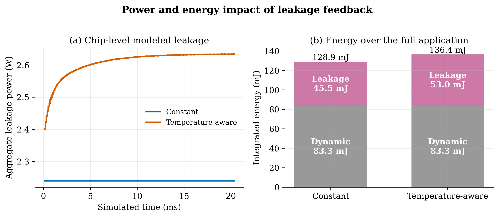
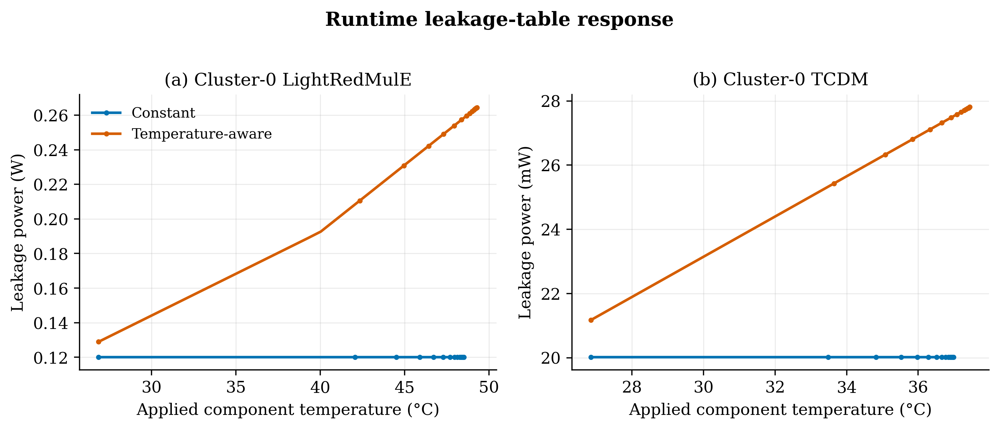
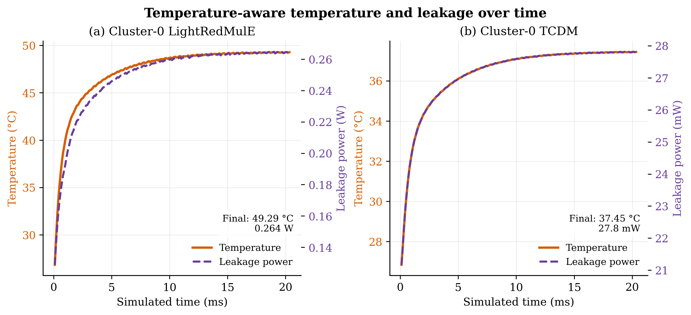
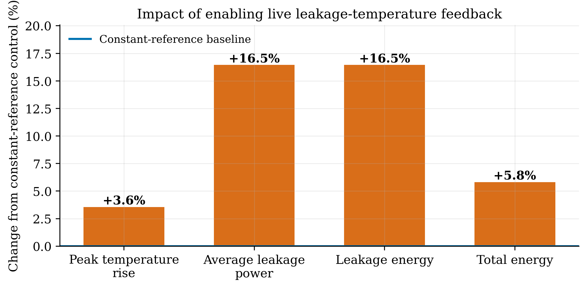

# Temperature-dependent leakage in SoftHier–3D-ICE

## Abstract

This controlled experiment quantifies the effect of temperature-dependent
leakage in the runtime-coupled SoftHier–3D-ICE loop. Both simulations execute
the same default 4096³ GEMM on the same 5nm, 16-cluster design
with 100 µs thermal exchanges. The control uses
the new 25 °C reference leakage for LightRedMulE and TCDM but holds it constant;
the treatment uses identical reference values and updates leakage from the live
3D-ICE temperatures. Temperature-aware leakage raises peak temperature by
**0.774 °C**, average leakage power by **16.46%**,
leakage energy by **16.46%**, and total modeled energy by
**5.81%**. These results demonstrate a positive
power–temperature feedback effect without conflating it with a different
nominal leakage assumption.

## Experimental design

| Item | Value |
|---|---|
| Workload | Provider-default 4096 × 4096 × 4096 GEMM, 4096 RedMulE tiles |
| Architecture | `SoftHier/soft_hier_sdk/examples/SoftHier/config/arch_NoC1024.py` |
| Technology | 5nm |
| Thermally coupled components | 16 LightRedMulE + 16 TCDM = 32 |
| Power/thermal interval | 100000000 ps |
| Simulated application time | 20.332641 ms |
| Control profile | `constant` |
| Treatment profile | `temperature_aware` |
| Constant run | `runs/leakage_constant_matched/20260831-183000` |
| Temperature-aware run | `runs/leakage_temperature_probe_fixed/20260831-183000` |

All architecture, workload, voltage lookup behavior, dynamic-energy tables,
thermal geometry, solver step, and initial conditions are held fixed. The sole
A/B factor is whether leakage remains at its 25 °C reference or follows the
temperature table.

## Leakage model

For each voltage point, the temperature-aware profile samples

```text
P_leak(T) = P_leak(25 °C) × 2^((T − 25 °C) / T_double)
```

at 25, 40, 55, 70, 85, 100, 115, and 125 °C. GVSoC linearly interpolates
between samples and clamps outside that characterized interval. At 5 nm, the
reference values are 3.4 µW/kGE for LightRedMulE and 20 mW/MiB for SRAM at
0.7 V; doubling temperatures are 22 °C and 27 °C, respectively. RedMulE power
scales with estimated gate count and SRAM power with instantiated capacity.
Dynamic energy retains the pre-existing tables. The platform's default 1.2 V
source query lies above the 5 nm table range and therefore clamps to the 0.7 V
endpoint in both runs; voltage behavior is identical across the A/B pair.

These values are physically plausible engineering assumptions chosen for a
sensitivity study, not measured silicon or sign-off characterization.



## Results

| Metric | Constant | Temperature-aware | Absolute change | Relative change |
|---|---:|---:|---:|---:|
| Peak component temperature (°C) | 48.59 | 49.36 | +0.774 °C | +1.59% |
| Peak temperature rise above 26.85 °C (°C) | 21.74 | 22.51 | +0.774 °C | +3.56% |
| Average aggregate leakage power (W) | 2.24 | 2.608 | +0.3686 W | +16.46% |
| Peak aggregate leakage power (W) | 2.24 | 2.634 | +0.3943 W | +17.61% |
| Active LightRedMulE peak leakage (W) | 0.12 | 0.2648 | +0.1448 W | +120.72% |
| Active TCDM peak leakage (W) | 0.02001 | 0.02781 | +0.007802 W | +38.99% |
| Leakage energy (mJ) | 45.54 | 53.03 | +7.494 mJ | +16.46% |
| Total modeled energy (mJ) | 128.9 | 136.4 | +7.494 mJ | +5.81% |
| Leakage energy fraction (%) | 35.34 | 38.89 | +3.553 percentage points | +10.06% |

The temperature-aware model increases the peak temperature rise by
**3.56%** relative to the controlled constant-leakage case.
Dynamic energy changes by
**0.000%**;
the analyzer rejects the A/B pair if dynamic energy differs by more than one
part per million, protecting the controlled-work equivalence.

## Figures









The dual-axis time-series plot places simulated time on the x-axis, component
temperature on the left y-axis, and leakage power on the right y-axis. It makes
their concurrent rise directly visible for the active LightRedMulE and TCDM
components under the temperature-aware profile.



Vector PDF versions are stored beside every PNG for direct use in slides or
publication figures.

## Interpretation

The constant profile already includes realistic nominal standby power, but it
cannot amplify as the die heats. In the treatment, every 3D-ICE response is
fed back into GVSoC and immediately re-interpolates the leakage tables. The
result is a causal loop: higher temperature increases leakage, increased
leakage raises the next interval's total power, and that additional power raises
subsequent temperatures. The effect is visible both in the leakage-versus-time
curve and in the separation of the temperature trajectories.

## Slide-ready takeaways

- Live temperature-dependent leakage increases peak temperature by
  **0.774 °C** (+3.56% of temperature rise).
- At their peak runtime temperatures, active LightRedMulE and TCDM leakage are
  **120.72%** and **38.99%**
  above their constant-reference values, respectively.
- Temperature-aware leakage energy is **16.46%** higher
  than the constant-reference estimate for this workload and assumed model.
- Total modeled energy is correspondingly **5.81%** higher,
  even though the dynamic-energy model and simulated execution are unchanged.

## Limitations

1. Leakage coefficients are synthetic, technology-scaled estimates, not a
   calibrated PDK/library characterization.
2. The model assumes instantiated RedMulE and TCDM blocks remain powered; it
   does not infer power gating for idle clusters.
3. The energy totals cover the 32 explicitly coupled RedMulE/TCDM components,
   not unmodeled cores, NoC, control logic, HBM, or package power.
4. This is one default GEMM workload and one thermal stack; conclusions should
   be reported as a sensitivity case rather than universal silicon prediction.
5. Voltage is not part of the feedback loop in this experiment; the same
   endpoint-clamped voltage lookup is used throughout both simulations.

## Reproducibility

```bash
make co-simulation RUN_NAME=leakage_constant \
  SOFTHIER_POWER_PROFILE=constant SIMULATOR_LOG_TAIL_LINES=0

make co-simulation RUN_NAME=leakage_temperature_aware \
  SOFTHIER_POWER_PROFILE=temperature_aware SIMULATOR_LOG_TAIL_LINES=0

MPLCONFIGDIR=/tmp/softhier-leakage-mpl \
  conda run -n py312 python experiments/leakage_temperature/analyze.py \
  --constant-run runs/leakage_constant/latest \
  --temperature-aware-run runs/leakage_temperature_aware/latest \
  --output-dir experiments/leakage_temperature/results/<study-id>
```

Machine-readable results are in `metrics.csv`, `comparison.json`, and
`timeseries.csv`. The complete generated lookup points for every supported
technology node are in `leakage_model_tables.csv`.
